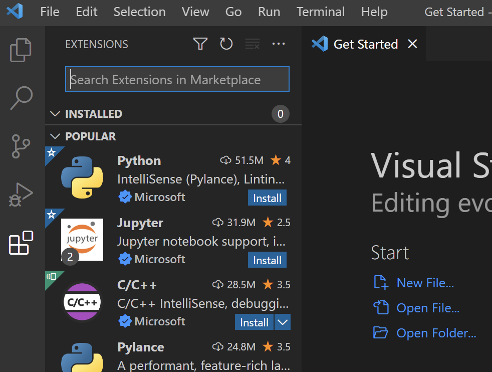
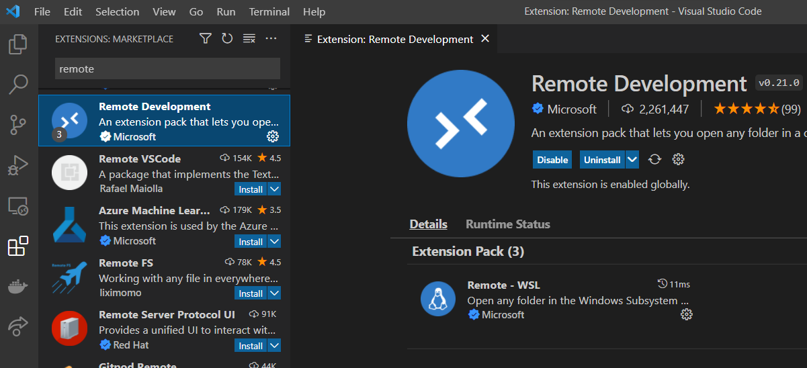
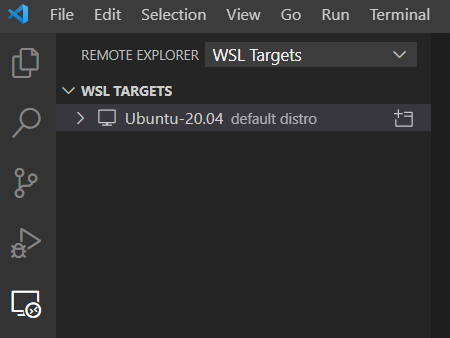
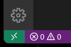
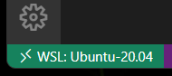

# VS Code Setup
These instructions are for setting up Visual Studio Code on Windows or Mac. You must follow the OS specific setup instructions prior to this ([Windows Setup](windows-setup.md))

## Install and Extensions
Download and install Code from Microsoft: https://code.visualstudio.com/download

Launch Code and switch to Extensions view, either by clicking the left hand icon that looks like several boxes, or by selecting Extensions from the view menu.

Type "remote" in the search box and install the Remote Development extension pack.

## WSL Connection
Open the Remote Exporer view and select WSL Targets. This will show each of the WSL distros you have installed.

Right click the Ubuntu distro and click **Connect to WSL**. This will open a new window that is connected to the WSL install. From there you can open a folder and start work just like any folder, but you are working withn the WSL system.

## Remote SSH Connection
Open the Remote Explorer view and select SSH Targets. This will show each of the entries in your SSH config file. Right click one and select **Connect to Host in Current Window**

If your SSH config is correct from earlier, you should see the servers from your .ssh/config file. Select your remote server and it will start connecting. Accept the remote fingerprint of the server if prompted.

If it all goes well it will connect without prompting for a password (using your SSH key). WHen it is successfully connected the green icon in the lower left will show the connection type and endpoint.

## Other Ways to Connect
For any of the remote connections (WSL, SSH) you can use the command palette directly to connect, or click the green icon in the lower left corner of the Code window. This will open the command palette with a number of WSL and SSH connection options.

When you are connected rmeotely, the icon will show the connection type and endpoint.

## Best Practices
I strongly recommend using the remote connection plus container for doing all development. Install the bare minimum on your dev system (from these guides) and install everything else you need in a dev container per project. This allows you to create self-contained dev environments that are repeatable, shareable, and have not risk of breaking your dev host. Note that this guide does not talk about installing extensions for python, go, c++, etc... those should be installed into the dev container for the projects that need them instead of being installed on your dev host.
