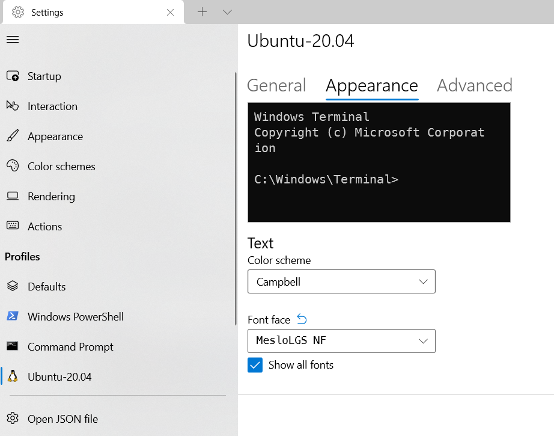
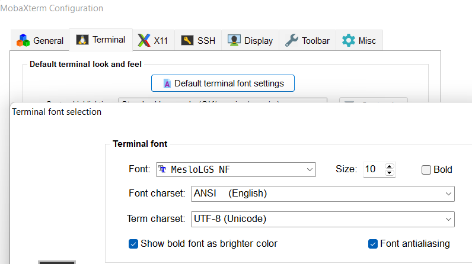

# Windows Setup
These instructions are for setting up Windows 11 with WSL, docker and VS Code to do containerized development (mostly python but works with other languages as well).

## Install and Configure WSL
Launch an elevated powershell window and install WSL2:
```
wsl --install
```
If you see the help text for the wsl command, that means you have WSL already installed and can continue on. Otherwise, this command will download and install the default linux distro (Ubuntu).

Reboot when the install is complete, and launch **Ubuntu** from the start menu to finish the configuration and create a user. Use the same username and password as your Windows install.

In a WSL terminal, create a wsl.conf file and enable file metadata (this makes commands like chmod work).
```
cat <<EOF | sudo tee /etc/wsl.conf
[automount]
options = "metadata"
EOF
```

Open an elevated powershell and restart WSL:
```
wsl --shutdown
```
Wait [8 seconds](https://docs.microsoft.com/en-us/windows/wsl/wsl-config#the-8-second-rule) for WSL to restart.

## Terminal
Download the Meslo Nerd monospace fonts, courtesy of [Powerlevel10k](https://github.com/romkatv/powerlevel10k/blob/master/font.md)
* [MesloLGS NF Regular.ttf](https://github.com/romkatv/powerlevel10k-media/raw/master/MesloLGS%20NF%20Regular.ttf)
* [MesloLGS NF Bold.ttf](https://github.com/romkatv/powerlevel10k-media/raw/master/MesloLGS%20NF%20Bold.ttf)
* [MesloLGS NF Italic.ttf](https://github.com/romkatv/powerlevel10k-media/raw/master/MesloLGS%20NF%20Italic.ttf)
* [MesloLGS NF Bold Italic.ttf](https://github.com/romkatv/powerlevel10k-media/raw/master/MesloLGS%20NF%20Bold%20Italic.ttf)
Open each font file and click Install.

Open **Windows Terminal** from the start menu. Th first time it is launched it should prompt you to set it as the default - do this. 
Wile you are in Setting, go down to Profiles, select Ubuntu and click Appearance. Change the font to MesloLGS NF and set the size to 
what you are comfortable with (I prefer 10). Save the settings and close the settings tab.



If you are using MobaXTerm, go the Settings menu and select Configuration -> Terminal -> Default terminal font settings and change the font to MesloLGS NF.



## Update Ubuntu
Update Ubuntu to the latest packages:
```
sudo apt-get update
sudo apt-get upgrade -y
```

## Install docker in WSL
Note this is not installing Docker Desktop, this is using the linux version of docker inside WSL.

The official instructions for installing docker on Ubuntu can be used: https://docs.docker.com/engine/install/ubuntu/  
Or follow the summary here.  
If you are going to copy-paste these instructions, execute some other sudo command first to authorize.
```
sudo apt-get update
sudo apt-get install --no-install-recommends -y ca-certificates curl gnupg
curl -fsSL https://download.docker.com/linux/ubuntu/gpg | sudo gpg --dearmor -o /usr/share/keyrings/docker-archive-keyring.gpg
echo "deb [arch=$(dpkg --print-architecture) signed-by=/usr/share/keyrings/docker-archive-keyring.gpg] https://download.docker.com/linux/ubuntu $(lsb_release -cs) stable" | sudo tee /etc/apt/sources.list.d/docker.list
sudo apt-get update
sudo apt-get install --no-install-recommends -y docker-ce docker-ce-cli containerd.io
sudo usermod -aG docker $USER
```
To make the docker daemon start on boot, configure /etc/wsl.conf to launch it on startup. You should already have a wsl.conf from the WSL/SSH setup, add a [boot] section to it to launch dockerd:
```
cat <<EOF | sudo tee -a /etc/wsl.conf
[boot]
command = "service docker start"
EOF
```
Now test docker by closing your terminal window and opening a new one, and by rebooting and opening a new WSL terminal. You should be able to run `docker version` and see the client and server versions.

## SSH Configuration
First make sure the OpenSSH client is installed in Windows. From an elevated powershell:
```
dism /online /Add-Capability /CapabilityName:OpenSSH.Client
```
Next we want to make our SSH configuration shared between Windows and WSL. From a WSL terminal, remove any existing Windows ssh config, create a new empty directory, and link it into your WSL home directory:
```
rm -r /mnt/c/Users/<winuser>/.ssh
mkdir -p /mnt/c/Users/<winuser>/.ssh
ln -fs /mnt/c/Users/<winuser>/.ssh ~/.ssh
```
Now we can create an SSH key:
```
ssh-keygen -t ed25519
```
Hit enter at the prompts to accept the defaults.

Configure SSH by creating `~/.ssh/config`. Here is a starting point with some defaults for all hosts, add your customizations for your particular hosts (see references below for more info):
```
echo <<EOF > ~/.ssh/config
Host *
    AddressFamily inet
    CheckHostIp no
    ConnectTimeout 20
    ConnectionAttempts 1
    GSSAPIAuthentication no
    HashKnownHosts no
    IdentitiesOnly yes
    ServerAliveInterval 10
    ServerAliveCountMax 30
    StrictHostKeyChecking ask
    TCPKeepAlive yes
    User root
    ForwardX11 no
    ForwardX11Trusted no
EOF
```
After creating the config file, make sure the file permissions are correct.
```
chmod 600 ~/.ssh/config
```
### References:
> * SSH client config - https://manpages.ubuntu.com/manpages/focal/en/man5/ssh_config.5.html
> * SSH commandline - https://manpages.ubuntu.com/manpages/focal/en/man1/ssh.1.html
> * SSH daemon config - https://manpages.ubuntu.com/manpages/focal/en/man5/sshd_config.5.html

SSH consumes configuration in this order:
1. Command line
2. User config file (~/.ssh/config)
3. System config file (/etc/ssh/ssh_config)

The FIRST place a config value is found, it will be used (later values do not override earlier values). This means that you can specify options on the commandline to override values in your config file. It also means that your config file should be written with the most specific host matching options at the top, to the least specific on the bottom.

## SSH Without Password
If you want to configure some servers to be able to SSH without typing a password, for instance to enable remote development, you need to copy your SSH key into the `authorized_keys` file on the server. The ssh-copy-id command does this for you:
```
ssh-copy-id -i ~/.ssh/id_ed25519.pub username@server_ip
```
The command will prompt you for the password for the user to connect and install the key. After the command completes successfully, the key is installed and you can now connect to the server with ssh username@server_ip and you will connect without being prompted for a password.

After adding your key to the server, you may wish to apply specific config options for it in your ssh config file:
```
Host <simple name>
    HostName <server_ip>
    User <username>
    IdentityFile ~/.ssh/id_ed25519
```
Add any SSH configuration options you want for this specific host. Make sure to add this host block above the `Host *` block.

You can set `<simple name>` to any string you want, it does not need to be the actual hostname. This allows you to ssh to that server using that name, eg if you set `<simple name>` to `myserver`, you can then `ssh myserver` and it will use the IP address you set in the config file to connect.
